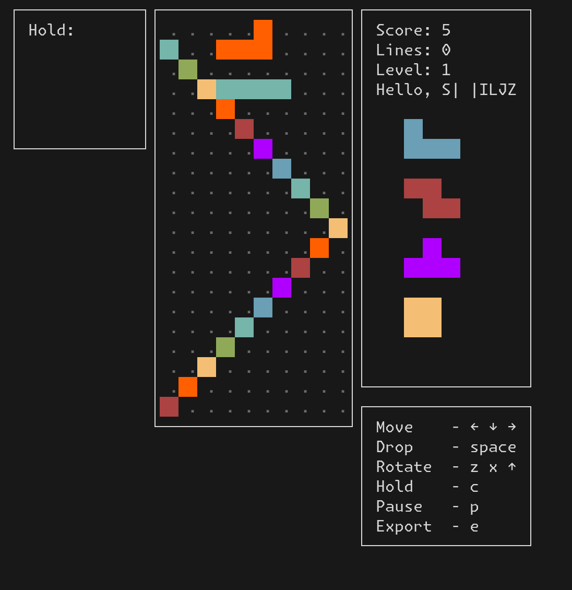

# Extremely Convenient Breaker 
## Summary
This challenge uses an insecure scheme of authenticating game saves with a MAC which allows a hash extention attack.

**Artifacts:**
* `board.py` game implementation of the board object
* `game.py` game implementation (slightly modified to make automated solving possible)
* `hlextend.py` hash extention library
* `secrets.py` the secrets file to simulate challenge
* `solve.py` the solve script
* `tmux_process` tmux helper functions

## Context
The challenge is a terminal tetris game. By playing a bit, we can see there is the normal tetris functionility, as well as a save game function.

Digging into the source code, we can see that the flag is printed if we manage to get the game state to look like the hardcoded variable `winning_board`. This board state is impossible to reach with normal game play

You can see it uses all peices in a diagonal pattern. With the square peice, it would be impossible to get one section of it isolated by just clearing rows.

Thus, our attention must turn to the save function. To load a save, first its checksum is checked. This checksum is given us when we save a game, and verified when we load one.
```python
def make_checksum(username, save_code):
    assert len(SECRET) == 40
    return hashlib.sha256((SECRET + username + save_code).strip()).hexdigest()
```

The secret is a random 40 bytes, the username is user defined, and the save code is what we are trying to control.

## Vulnerability 
There is a chain of issues that make this attack possible. The first is that completly user controlled data is hashed, in the form of the username.

Looking at how the username is read in, there are no limits on what it can contain, aside from the fact that it cant contain newlines, and must be below 32 chars.

```python
username = sys.stdin.buffer.readline()[:-1]
    while len(username) > 32:
        print("Username too long. Please try again")
        username = sys.stdin.buffer.readline()[:-1]
```

The second peice of the checksum is the game save state.
```python
def __repr__(self):
    block_type_text = ["T", "J", "L", "S", "Z", "O", "I"]
    ret = block_type_text[self.current_block.block_type] + "|"
    if self.held_piece:
        ret += block_type_text[self.held_piece.block_type]
    else:
        ret += " "
    ret += "|"
    for block in self.next_blocks:
        ret += block_type_text[block.block_type]
    ret += "|"
    for block in self.piece_queue:
        ret += block_type_text[block]
    ret += "|"
    for row in self.board:
        for tile in row:
            if tile == 0:
                ret += " "
            else:
                ret += block_type_text[tile - 1]
    return ret
```
We can see they are sections of blocks seperated by pipes. 
```
held_peice | next_blocks | peice_queue | board
```
board is the longest by far. The rest, including the pipes, often totals around 12 characters. The board is 200, for 10x20 board size, and 1 char for each peice.

At the end though, if the board square is empty, it actually puts a space instead of a non-whitespace character. When we combine this with the fact that the string is stripped before it is hashed in the save code, this means that if the board is empty or near empty, we the effective size of game save state can be very low, much lower than the username.

This lends itself to something called a hash extension attack. For certian hash algorithems, such as sha256, if we have the hash of some, we may be able to append extra data to that block and still create a vaid checksum.

SHA256 follows this process: It takes the input data, and padds it out to a block size (16 bytes/block) This padding must end with an 8 byte number showing how many bits are in the data to be hashed. For example, if I was hashing 20 bytes (160 bits), the data that would be fed into the hashing function would be | data (20 bytes) | padding (4 bytes) | unsigned_long 160 (8 bytes)

Then, the first block would be fed into a hashing algorithm. This would just be 16 bytes of the input. The state of the hash would then be fed into the next round, along with the second block, which is 4 bytes of the input, as well as the padding and length. The state after this would be returned as the output of sha256.

Thus, by knowing the hash, we know the internal state of sha256 after it is done hashing. So, without knowing all of the original data (the secret,) we can use a hash extension attack like this to get a game state authenticated.


## Exploitation
**Exploit overview**: The exploit uses a hash extension attack on sha256 to authenticate an impossible game state.

**Input restrictions**:
The username must be less than 32 bytes

**Exploit Description**: In our forst interaction with the program, we enter an empty username and an empty game save to it starts a brand new game. In the original challenge, we would then have to play until the board is cleared, as we could not save until we had earned points, and we need a clear board for the exploit to work. My modified file does away with this requirement to simplicity in demenstrating the exploit live.

Once we can, we save the board state, and make note of the game save state and checksum.

We can form a winning game save state, and perform the hash extension attack. This will give us a new checksum, and a combination of the old save state and padding that we will pass in as the username.

```
OLD CHECKSUM: | SECRET + short_save + padding | 
NEW CHECKSUM: | SECRET + username (short_save + old_padding) + winning_save + new_padding |
```

Because we know the hash output of the old version, we know the sha256 state after the first couple (in this case, 2) blocks in the new version, since they are the same. That allows us to append more data, and calculate the new checksum which the server will accept.

```
Congratulations! You won!
lactf{T3rM1n4L_g4mE5_R_a_Pa1N_2e075ab9ae6ae098}
```

This exploit for hash extension relies on a couple of things. Firstly, it requires us to be able to pass in the padding and int as user input. In this challenge, that was possibe in the username, but may sometimes be challenging because this generally includes a lot of non-printable bytes. Secondly, we need to know the length of secret so we can know block alignments. As long as it is short enough, this can be brute forcable or guessable even if we dont know.

**Exploit primitives used**: 
* SHA256 hash extension
* Known input control


## Remediation
This is a feindish vulnability, and I could see something like this existing in the real world. The main issue is that they allow arbitrary username data to be a part of the save state, and they include this in the hash.

Stripping the save code before hashing is only an issue here because they were relying on the length of the username being low enough such that the save code could not fit, and is not an inherent target for remediation itself.

The best and most repeatable solution would be to use a proper HMAC instead of trying to roll your own message authentication scheme for the checksum.